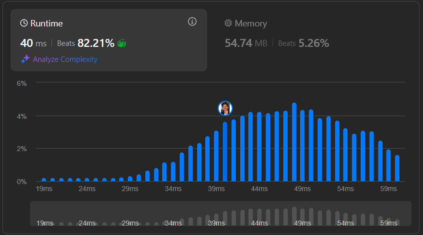

# **LeetCode - 30 Days JavaScript Challenge**

## 📅 **Day 10: Allow One Function Call**

## 📌 Problem Statement

**LeetCode Problem:** [`2666. Allow One Function Call`](https://leetcode.com/problems/allow-one-function-call/description)

📌 **Description:**  
Implement a function `once(fn)`, which ensures that the given function `fn` **can only be called once**. Any subsequent calls should return `undefined`.

---

## 🧠 **Intuition**

The problem requires **function limiting**, where a function should only be **executed once** and ignored thereafter.

To solve this, we need a mechanism to track whether `fn` has already been called. We can achieve this by using:

- A **counter** (to count function calls).
- A **boolean flag** (to mark execution).
- A **ternary operator** (for a concise solution).

---

## 💡 **Approach**

### 🔹 **Approach 1: Using a Counter (Basic & Easy to Understand)**

```js
var once = function (fn) {
  let called = 0;
  return function (...args) {
    called++;
    if (called > 1) {
      return undefined;
    } else {
      return fn(...args);
    }
  };
};
```

📌 **Explanation:**

- Uses a counter `called` to track function calls.
- If `called > 1`, returns `undefined`.
- Otherwise, executes `fn(...args)`.

✅ **Pros**: Beginner-friendly and simple.  
❌ **Cons**: Uses an unnecessary counter when a boolean flag would suffice.

---

### 🔹 **Approach 2: Using a Boolean Flag (More Optimized)**

```js
var once = function (fn) {
  let called = false;
  return function (...args) {
    if (!called) {
      called = true;
      return fn(...args);
    }
  };
};
```

📌 **Why is this better?**

- Uses a **boolean flag** (`called = true`) instead of a counter.
- The first call executes `fn(...args)`, then blocks further calls.

✅ **Pros**: More **efficient** and **cleaner** than the first approach.  
❌ **Cons**: None, it’s an optimal solution.

---

### 🔹 **Approach 3: Using a Ternary Operator (Most Concise & Elegant)**

```js
var once = (fn) => {
  let isCalled = false;
  return (...args) =>
    !isCalled ? ((isCalled = true), fn(...args)) : undefined;
};
```

📌 **Why is this useful?**

- Uses a **ternary operator** to reduce code size.
- The first call executes `fn`, while subsequent calls return `undefined`.

✅ **Pros**:

- **Compact & efficient** solution.
- Uses **arrow functions** for cleaner syntax.

❌ **Cons**:

- Slightly **less readable** for beginners.

---



---

## ⏳ **Complexity Analysis**

- **Time Complexity:**
  - $$O(1)$$ → Each function call executes in constant time.
- **Space Complexity:**
  - $$O(1)$$ → Only a single flag variable is used.

---

## ✅ **Solution Code**

```js
/**
 * @param {Function} fn
 * @return {Function}
 */
var once = function (fn) {
  let called = false;
  return function (...args) {
    if (!called) {
      called = true;
      return fn(...args);
    }
  };
};

/**
 * const fn = once((x) => x * 2);
 * console.log(fn(2)); // 4
 * console.log(fn(3)); // undefined
 */
```

---

## 📚 **Important Topics to Learn**

- **Higher-Order Functions**: Functions that accept or return other functions.
- **Closures**: Retaining function state using outer scope variables.
- **Function Wrapping**: Encapsulating function execution inside another function.

---

## 🔗 **Solution Discussion**

Check out my solution on LeetCode: [`2666. Allow One Function Call - Solution`](https://leetcode.com/problems/allow-one-function-call/solutions/6572905/2666-leetcode-allow-one-function-call-so-br49)

---

## 🚀 **Support & Feedback**

✅ If you found this helpful, **please star⭐ the repository!**  
💬 Let’s discuss alternative solutions & improvements! 🚀

---
